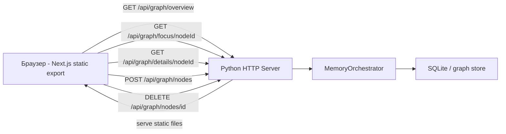
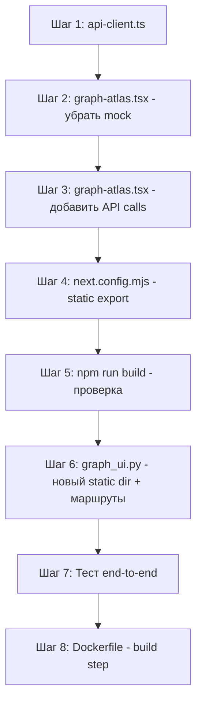

# План миграции: graph_ui → graph-ui-new

## Обзор

Текущий UI (`fagent/static/graph_ui/`) — монолитный HTML+JS на Vanilla JS с vis-network.  
Новый UI (`fagent/static/graph-ui-new/`) — Next.js 16 + React 19 + Tailwind + react-force-graph, красивее, но данные захардкожены.

**Цель:** подключить новый UI к существующему Python-бэкенду (`fagent/memory/graph_ui.py`), заменить генераторы тестовых данных реальными вызовами API.

---

## Анализ: что уже совместимо

### Формат данных бэкенда (`RawNode` / `RawEdge`)

Бэкенд (`orchestrator.export_graph_overview`) возвращает:

```json
{
  "nodes": [
    {
      "id": "entity-abc",
      "label": "John Doe",
      "metadata": {
        "kind": "entity",
        "priority_score": 8,
        "confidence": 0.95,
        "is_cluster": false,
        "visual": { "size": 25, "color": "#4ECDC4" }
      },
      "degree": 12
    }
  ],
  "edges": [
    {
      "source_id": "entity-abc",
      "target_id": "fact-xyz",
      "relation": "has_role",
      "weight": 1.0,
      "metadata": { "is_aggregate": false }
    }
  ],
  "mode": "global-clustered",
  "message": "Atlas loaded.",
  "hidden_node_count": 42,
  "hidden_edge_count": 120,
  "search_results": [
    {
      "id": "entity-abc",
      "label": "John Doe",
      "kind": "entity",
      "is_cluster": false,
      "priority_score": 8
    }
  ]
}
```

**✅ Хорошая новость:** интерфейс [`RawNode`](fagent/static/graph-ui-new/lib/graph-types.ts:38) и [`RawEdge`](fagent/static/graph-ui-new/lib/graph-types.ts:54) в новом UI **уже совместим** с форматом бэкенда. Поля: `id`, `label`, `metadata.kind`, `metadata.priority_score`, `metadata.is_cluster`, `metadata.cluster_size`, `degree` — все присутствуют.

Интерфейс [`GraphPayload`](fagent/static/graph-ui-new/lib/graph-types.ts:66) тоже уже объявлен и совместим с бэкендом.

---

## Архитектурная схема



---

## Изменения: пошаговый план

### Шаг 1 — Создать `lib/api-client.ts` в новом UI

**Файл:** [`fagent/static/graph-ui-new/lib/api-client.ts`](fagent/static/graph-ui-new/lib/api-client.ts)

Создать модуль API-клиента с функциями:

```typescript
export async function fetchGraphOverview(params: {
  query?: string;
  session?: string;
  mode?: "global-clustered" | "global-raw";
  node_limit?: number;
  edge_limit?: number;
}): Promise<GraphPayload>;

export async function fetchGraphFocus(
  nodeId: string,
  params?: {
    query?: string;
    session?: string;
  },
): Promise<FocusPayload>;

export async function fetchGraphDetails(
  nodeId: string,
  params?: {
    query?: string;
    session?: string;
  },
): Promise<NodeDetails>;

export async function upsertNode(data: NodeUpsertPayload): Promise<void>;
export async function deleteNode(nodeId: string): Promise<void>;
export async function upsertEdge(data: EdgeUpsertPayload): Promise<void>;
export async function deleteEdge(
  sourceId: string,
  relation: string,
  targetId: string,
): Promise<void>;
```

Важно: базовый URL берётся из `window.location.origin` (тот же сервер).

---

### Шаг 2 — Модифицировать `components/graph/graph-atlas.tsx`

**Файл:** [`fagent/static/graph-ui-new/components/graph/graph-atlas.tsx`](fagent/static/graph-ui-new/components/graph/graph-atlas.tsx)

#### 2.1 — Убрать генератор тестовых данных

Удалить:

- импорт `generateTestData` из `@/lib/test-data`
- блок `DataSettings` компонент и его использование
- `dataSettings` state, `dataKey` state, `handleRegenerateData` callback

#### 2.2 — Добавить загрузку с API

Добавить:

- `useState` для `loading`, `error`
- `useState` для `mode: 'global-clustered' | 'global-raw'`
- `useState` для `query` и `session` (читать из `window.location.search` при инициализации)
- `useEffect` с вызовом `fetchGraphOverview({ query, session, mode })` при монтировании и при изменении `mode`
- Обработка `search_results` из ответа API для `SearchPanel`

#### 2.3 — Подключить `handleSelectNode` к API

Текущий `getNodeDetails` из `@/lib/test-data` заменить на:

- Вызов `fetchGraphDetails(nodeId)` который вернёт `NodeDetails`
- Опционально вызывать `fetchGraphFocus(nodeId)` для показа соседей в canvas (или встроить соседей из details)

#### 2.4 — Добавить панель управления режимом (вместо DataSettings)

Добавить простой toolbar с:

- Select для `mode` (Atlas / Raw)
- Input для `query`
- Input для `session`
- Кнопка "Reload"

---

### Шаг 3 — Обновить `lib/test-data.ts`

**Файл:** [`fagent/static/graph-ui-new/lib/test-data.ts`](fagent/static/graph-ui-new/lib/test-data.ts)

Функцию `getNodeDetails` вынести/заменить: теперь детали всегда берутся с API. Файл `test-data.ts` можно оставить только для режима разработки (dev-mode заглушки).

---

### Шаг 4 — Настроить `next.config.mjs` для static export

**Файл:** [`fagent/static/graph-ui-new/next.config.mjs`](fagent/static/graph-ui-new/next.config.mjs)

```javascript
const nextConfig = {
  output: "export", // ← ключевой параметр
  trailingSlash: true, // index.html в каждой папке
  typescript: {
    ignoreBuildErrors: true,
  },
  images: {
    unoptimized: true,
  },
};
```

После `next build` появится папка `out/` со статическими файлами.

**⚠️ Ограничение:** `output: 'export'` несовместим с `next/dynamic` с SSR. Нужно убедиться, что все компоненты с `dynamic()` имеют `ssr: false` (уже сделано в `graph-atlas.tsx`).

---

### Шаг 5 — Обновить `fagent/memory/graph_ui.py`

**Файл:** [`fagent/memory/graph_ui.py`](fagent/memory/graph_ui.py)

#### 5.1 — Изменить `_STATIC_DIR`

```python
# Было:
_STATIC_DIR = Path(__file__).resolve().parent.parent / "static" / "graph_ui"

# Станет:
_STATIC_DIR = Path(__file__).resolve().parent.parent / "static" / "graph-ui-new" / "out"
```

#### 5.2 — Обновить обслуживание статических файлов

Next.js static export создаёт структуру:

```
out/
  index.html
  _next/
    static/
      chunks/
      css/
  favicon.ico
  ...
```

Текущий сервер обслуживает только `/` и `/assets/*`. Нужно добавить:

- Обслуживание `/_next/static/*` (JS/CSS chunks)
- Обслуживание произвольных `.html` страниц (для React Router, если появятся)
- Корректные `Content-Type` для `.js`, `.css`, `.html`, `.png`, `.svg`

**Новая логика `do_GET`:**

```python
def do_GET(self) -> None:
    parsed = urlparse(self.path)

    # API endpoints - без изменений
    if parsed.path.startswith("/api/"):
        # ... существующий код ...
        return

    # Static files
    static_path = parsed.path.lstrip("/") or "index.html"
    file_path = (_STATIC_DIR / static_path).resolve()

    # Security check
    if not str(file_path).startswith(str(_STATIC_DIR)):
        self._send_json({"error": "forbidden"}, status=HTTPStatus.FORBIDDEN)
        return

    # SPA fallback: если файл не найден — отдать index.html
    if not file_path.exists() or file_path.is_dir():
        file_path = _STATIC_DIR / "index.html"

    if not file_path.exists():
        self._send_json({"error": "not_found"}, status=HTTPStatus.NOT_FOUND)
        return

    content_type = _get_content_type(file_path.suffix)
    self._serve_file(file_path, content_type)
```

Добавить вспомогательную функцию:

```python
def _get_content_type(suffix: str) -> str:
    types = {
        ".html": "text/html; charset=utf-8",
        ".js": "application/javascript; charset=utf-8",
        ".css": "text/css; charset=utf-8",
        ".json": "application/json; charset=utf-8",
        ".svg": "image/svg+xml",
        ".png": "image/png",
        ".ico": "image/x-icon",
        ".woff2": "font/woff2",
        ".woff": "font/woff",
    }
    return types.get(suffix.lower(), "application/octet-stream")
```

#### 5.3 — Добавить CORS-заголовки

Для dev-режима (запуск `next dev` на другом порту):

```python
self.send_header("Access-Control-Allow-Origin", "*")
self.send_header("Access-Control-Allow-Methods", "GET, POST, PATCH, DELETE, OPTIONS")
self.send_header("Access-Control-Allow-Headers", "Content-Type")
```

Добавить `do_OPTIONS` метод для preflight-запросов.

---

### Шаг 6 — Обновить Dockerfile

**Файл:** [`Dockerfile`](Dockerfile)

Добавить шаг сборки нового UI перед копированием исходников:

```dockerfile
# Build graph-ui-new (Next.js static export)
COPY fagent/static/graph-ui-new/ /tmp/graph-ui-new/
WORKDIR /tmp/graph-ui-new
RUN npm install --legacy-peer-deps && npm run build
RUN cp -r out/ /app/fagent/static/graph-ui-new/out/
WORKDIR /app
```

Либо более чистый вариант — включить `pnpm` и использовать его (`pnpm-lock.yaml` уже есть).

---

### Шаг 7 — Добавить `query`/`session` параметры в URL-поддержку

**Файл:** [`fagent/static/graph-ui-new/components/graph/graph-atlas.tsx`](fagent/static/graph-ui-new/components/graph/graph-atlas.tsx)

При инициализации компонента читать параметры из URL:

```typescript
useEffect(() => {
  const params = new URLSearchParams(window.location.search);
  const q = params.get("query") || "";
  const s = params.get("session") || "";
  const m = (params.get("mode") || "global-clustered") as Mode;
  setQuery(q);
  setSession(s);
  setMode(m);
  // затем загрузить данные с этими параметрами
}, []);
```

Это сохраняет совместимость со старым поведением: бэкенд передаёт URL вида `http://127.0.0.1:8765/?query=foo&session=bar`.

---

### Шаг 8 — Поддержка режима (mode: atlas / raw)

**Файл:** [`fagent/static/graph-ui-new/components/graph/toolbar.tsx`](fagent/static/graph-ui-new/components/graph/toolbar.tsx)

Добавить в [`Toolbar`](fagent/static/graph-ui-new/components/graph/toolbar.tsx) пропс:

```typescript
interface ToolbarProps {
  // ... существующие ...
  graphMode?: "global-clustered" | "global-raw";
  onGraphModeChange?: (mode: "global-clustered" | "global-raw") => void;
  onReloadGraph?: () => void;
}
```

В `graph-atlas.tsx` подключить этот callback к перезагрузке данных с API.

---

## Детали совместимости форматов

### `RawNode` бэкенд → фронтенд маппинг

| Поле бэкенда                   | Поле фронтенда                    | Примечание                   |
| ------------------------------ | --------------------------------- | ---------------------------- |
| `node.id`                      | `RawNode.id`                      | ✅ совпадает                 |
| `node.label`                   | `RawNode.label`                   | ✅ совпадает                 |
| `node.metadata.kind`           | `RawNode.metadata.kind`           | ✅ совпадает                 |
| `node.metadata.priority_score` | `RawNode.metadata.priority_score` | ✅ совпадает                 |
| `node.metadata.is_cluster`     | `RawNode.metadata.is_cluster`     | ✅ совпадает                 |
| `node.metadata.cluster_size`   | `RawNode.metadata.cluster_size`   | ✅ совпадает                 |
| `node.degree`                  | `RawNode.degree`                  | ✅ совпадает                 |
| `node.metadata.confidence`     | нет прямого                       | Используется в details-panel |

### `NodeDetails` бэкенд → фронтенд маппинг

Бэкенд (`export_graph_details`) возвращает:

```json
{
  "selected_id": "entity-abc",
  "kind": "entity",
  "title": "John Doe",
  "summary": "5 neighbors, 3 edges.",
  "metadata": { "kind": "entity", "confidence": 0.95, ... },
  "neighbors": [ { "id": ..., "label": ..., "metadata": ... } ],
  "edges": [ { "source_id": ..., "target_id": ..., "relation": ... } ]
}
```

Фронтенд [`NodeDetails`](fagent/static/graph-ui-new/lib/graph-types.ts:82):

```typescript
interface NodeDetails {
  selected_id: string;
  title: string;
  kind: NodeKind;
  summary?: string;
  metadata?: Record<string, unknown>;
  neighbors?: RawNode[];
  edges?: RawEdge[];
}
```

✅ **Полная совместимость без изменений!**

---

## Отличия в архитектуре: что убрать из нового UI

| Компонент                                                                                | Действие                               |
| ---------------------------------------------------------------------------------------- | -------------------------------------- |
| [`DataSettings`](fagent/static/graph-ui-new/components/graph/graph-atlas.tsx:61) popover | ❌ Удалить (генератор тестовых данных) |
| `generateTestData()` вызов                                                               | ❌ Удалить                             |
| `dataSettings` / `dataKey` state                                                         | ❌ Удалить                             |
| Надпись `Demo Mode` в Header                                                             | ✏️ Заменить на статус загрузки         |
| `getNodeDetails` из test-data                                                            | ✏️ Заменить вызовом API                |
| [`lib/test-data.ts`](fagent/static/graph-ui-new/lib/test-data.ts)                        | ⚠️ Оставить как dev-fallback           |

---

## Что добавить в новый UI

| Компонент                                                           | Действие                                   |
| ------------------------------------------------------------------- | ------------------------------------------ |
| [`lib/api-client.ts`](fagent/static/graph-ui-new/lib/api-client.ts) | ✅ Создать новый файл                      |
| Loading spinner при загрузке                                        | ✅ Добавить в GraphAtlasInner              |
| Error state с retry кнопкой                                         | ✅ Добавить в GraphAtlasInner              |
| Graph mode selector (Atlas/Raw)                                     | ✅ Добавить в Toolbar                      |
| Query/Session input в UI                                            | ✅ Добавить в Toolbar или отдельную панель |
| Cluster expand через API                                            | ✅ Реализовать `handleExpandCluster`       |
| CORS в dev-режиме                                                   | ✅ Добавить в `graph_ui.py`                |

---

## Порядок реализации



---

## Риски и решения

| Риск                                                      | Решение                                                                 |
| --------------------------------------------------------- | ----------------------------------------------------------------------- |
| `next/dynamic` с `ssr: false` и `output: export`          | Уже использован `ssr: false` везде — ✅                                 |
| Большие chunk-файлы Next.js (медленная загрузка)          | Допустимо для локального инструмента                                    |
| `handleExpandCluster` был no-op                           | Реализовать через `fetchGraphFocus(clusterId)` + обновление nodes/edges |
| Dev-режим (без сборки)                                    | Оставить возможность запуска `next dev` с CORS-поддержкой в бэкенде     |
| Различие в формате `id` для кластеров (`cluster:` prefix) | Уже обрабатывается в `orchestrator.py` — передаётся as-is               |
